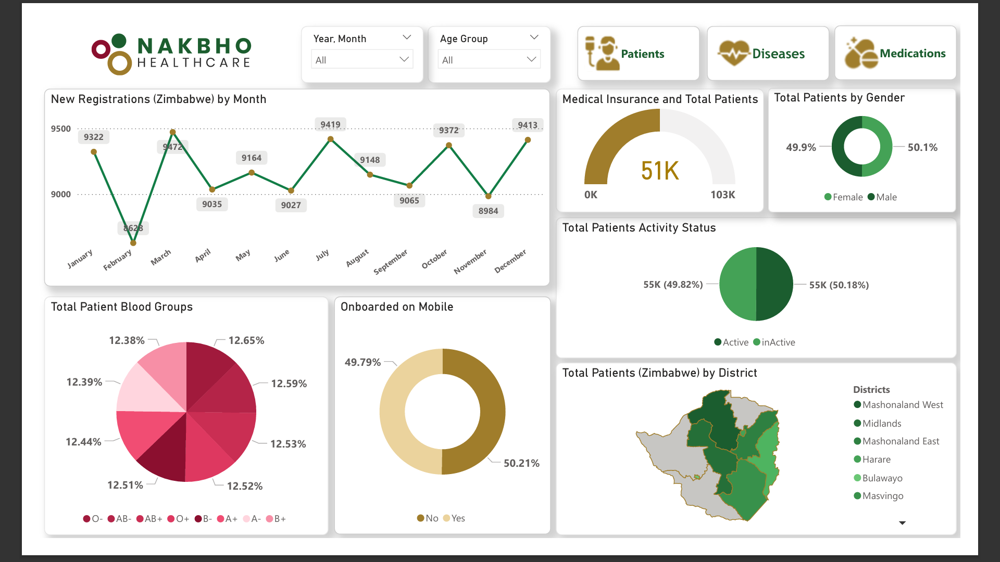
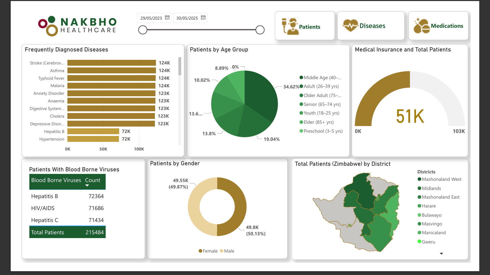
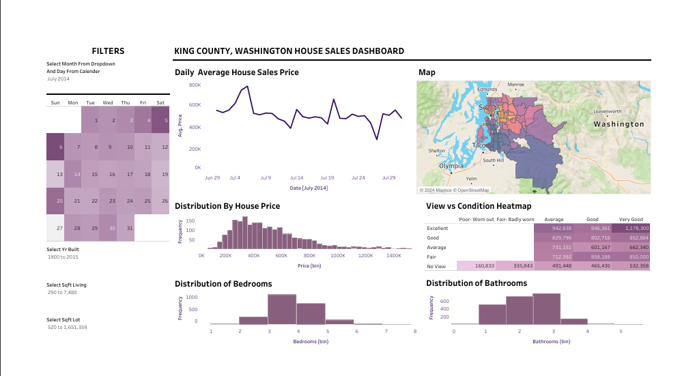
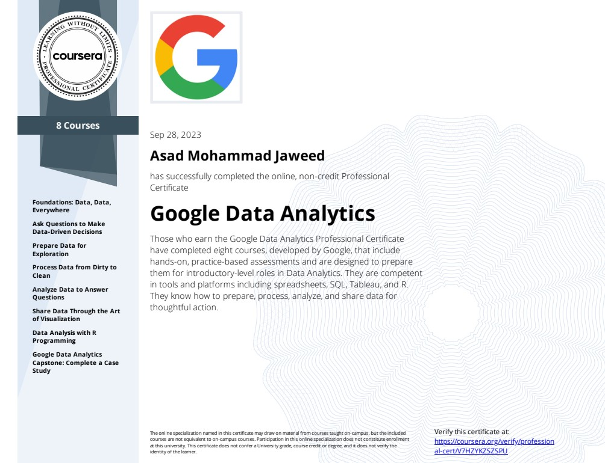
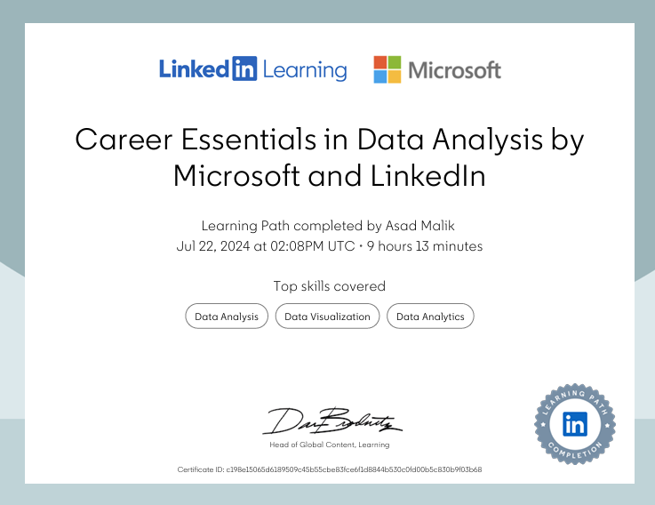
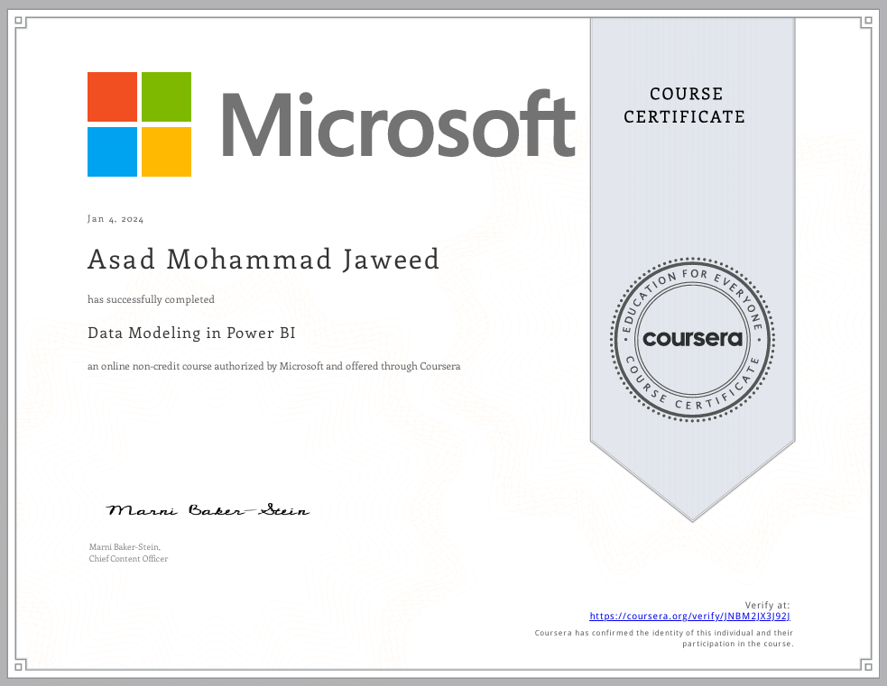
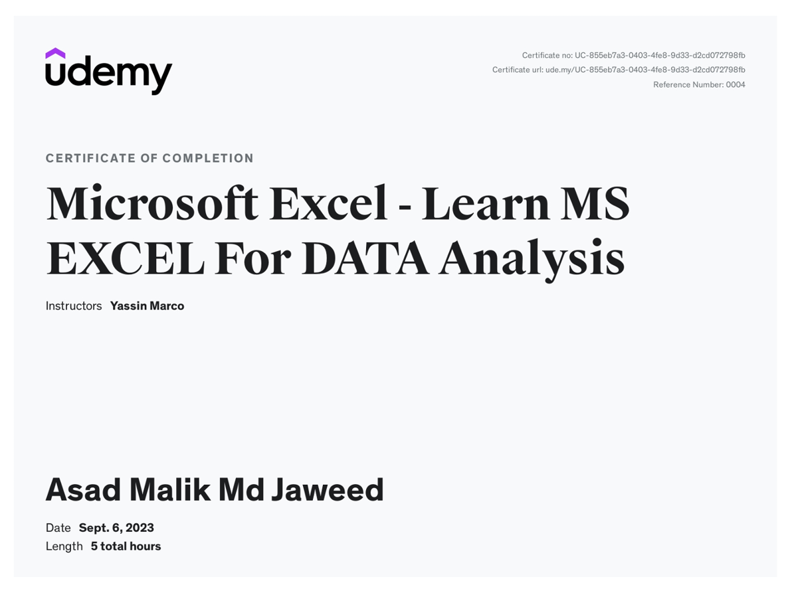
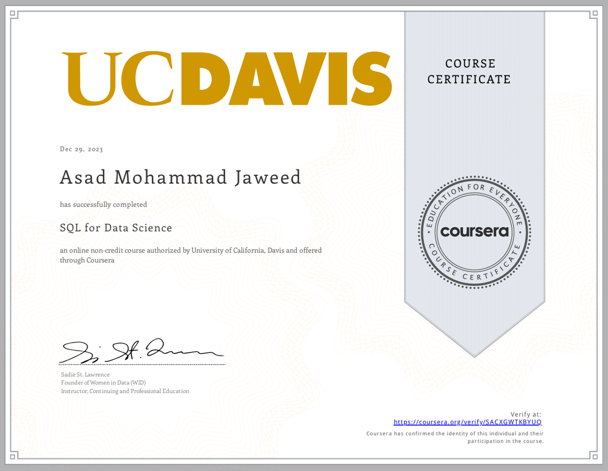
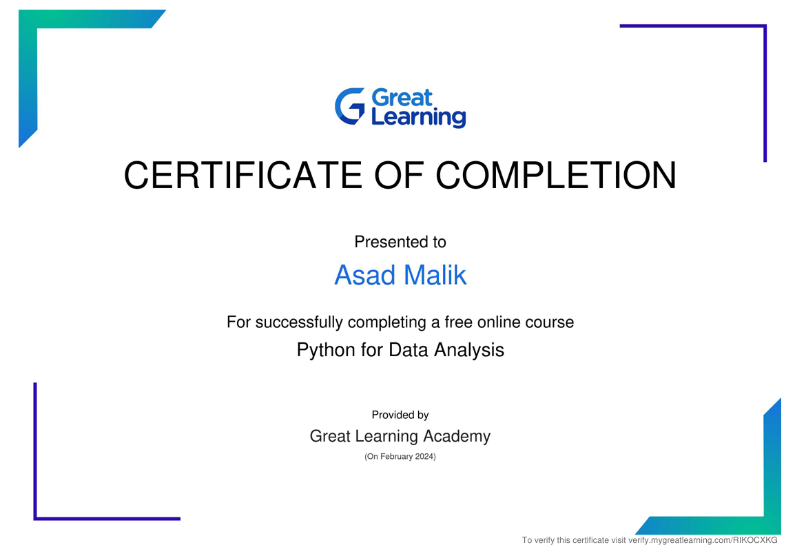

<!-- ===================== BANNER ===================== -->

  

<h3 align="center">
📊 Data Analyst | 📈 Power BI Developer | 🧠 Data Science Professional
</h3>

<strong>1+ Year Experience • Power BI • SQL • Python • Business Intelligence</strong>

Turning complex data into clear, decision-ready insights 🚀

---

## 👨‍💻 Professional Summary

I am a **Data Analyst & Power BI Developer with 1+ year of hands-on experience**, specializing in **dashboard development, data modeling, ETL pipelines, and business analytics**. I have worked on **real-world healthcare and HR analytics projects**, delivering measurable business impact.

- 📊 Power BI | DAX | Power Query | SQL | Excel
- 🏥 Healthcare Analytics (215K+ records)
- 🧑‍💼 HR & Workforce Analytics
- 📈 KPI Dashboards | MIS Reporting | Data Storytelling
- 📍 India | Open to Data Analyst / Power BI Developer roles

📧 **Email:** asadmalik1011@gmail.com  
🔗 **GitHub:** https://github.com/Malikasad74  

---

## 🏢 Experience

### 🏥 **Power BI Developer — Noorisys Technologies**  
📍 Nashik, India | 🗓️ **May 2025 – Sep 2025**

- Built a **Healthcare Analytics Platform** for *Nakbho Healthcare (Zimbabwe)*
- Transformed **215,000+ patient records** across **7+ districts**
- Designed **star-schema data models** & optimized DAX
- Automated ETL for **30K+ monthly records**
- Improved reporting accuracy by **40%+**
- Enabled **45% faster decision-making**

Tech Stack: Power BI, DAX, Power Query, SQL, Python, Excel, MongoDB

---

### 📊 **Data Visualization Intern — Cognifyz Technologies**
📍 Remote | 🗓️ Apr 2024 – May 2024

- Transformed raw, complex datasets into insight-driven dashboards using advanced Excel functions, pivot tables, and data cleaning techniques.
- Analyzed trends, identified patterns, and highlighted key business insights for decision-making.
- Applied chart design and visualization best practices to deliver professional, executive-ready reports.

Tools: Excel, Pivot Tables, Data Cleaning, Dashboard Design

---

### 🧑‍💼 **Power BI Developer Intern — Psyliq**  
📍 Remote | 🗓️ **Jan 2024 – Mar 2024**

- Developed HR dashboards on **1,470+ employee records**
- Attrition, salary band, age & department analysis
- Improved dashboard performance by **30%**
- Increased report adoption by **45%**

Tools: Power BI, DAX, Data Modeling, Data Cleaning

---

## 🛠️ Skills & Tools

**Core Keywords:**  
Power BI Developer · Data Analyst · DAX · SQL · Excel · Power Query · ETL · Data Modeling · Dashboarding · MIS · Healthcare Analytics · HR Analytics · Business Intelligence

---

## 🔥 Power BI & Analytics Projects (With Dashboards)

### 🏥 Healthcare Analytics Dashboard — Power BI

- 215K+ patient records | 7+ districts
- Disease trends, age/gender, insurance coverage
- Medication frequency (10K–100K scale)
- Public health KPI reporting

---

### 🧑‍💼 HR Analytics Dashboard — Power BI
🔗 https://github.com/Malikasad74/HRAnalysis.git

- Attrition rate (16%)
- Department & salary analysis
- Job satisfaction & workforce insights

---

### 🏠 Housing Sales Dashboard — Tableau  
🔗 https://github.com/Malikasad74/HousingSalesTableau

- 21K+ housing transactions
- Price trends, heatmaps, filters

---

### 🛒 E-Commerce Purchase Behavior — Python  
🔗 https://github.com/Malikasad74/Ecommerce-Purchases-EDA-Project

- 10K+ transactions
- Customer segmentation & trends
- Payment & language-based insights

---

## 📜 Certifications & Professional Learning

> 📌 *Continuous learning to strengthen data-driven decision-making, analytics, and business intelligence skills.*

---

### 🎓 Google Data Analytics Professional Certificate  

  

---

### 📊 Advanced Data Science & Analytics Mentorship (Pregrad)  

  

---

### 🧠 Career Essentials in Data Analysis  
**Microsoft × LinkedIn Learning**  

  

---

### 📈 Microsoft Data Modeling in Power BI  

  

---

### 📊 Microsoft Excel for Data Analysis (Udemy)  

  

---

### 🗄️ SQL for Data Science – UC Davis  

  

---

### 🐍 Python for Data Analysis – Great Learning  

  

---

## 📈 GitHub Stats

  

---

<b>📊 Data tells a story — I turn it into decisions.</b>

